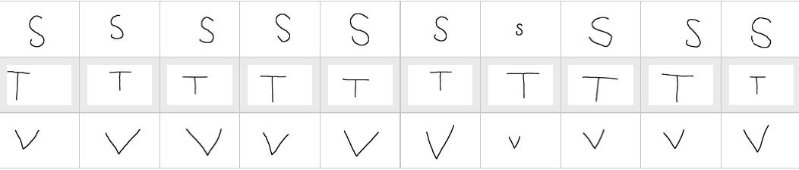
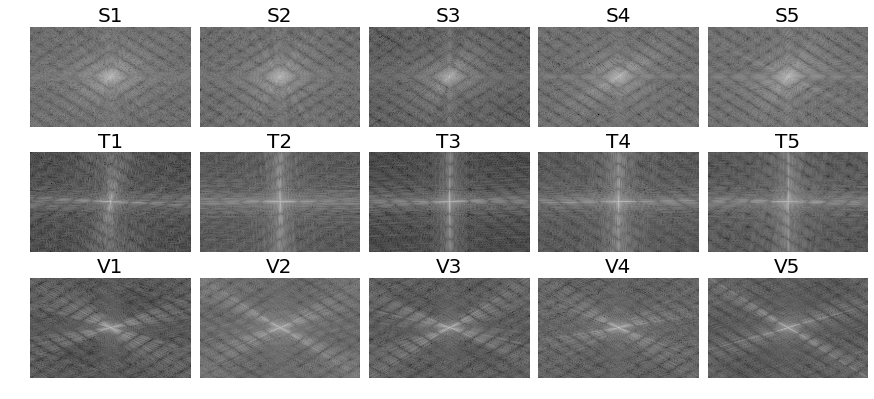
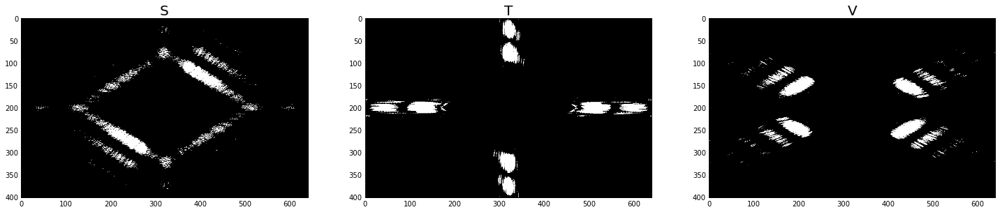
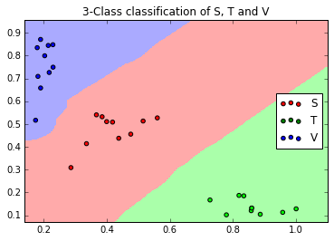

# Letter Recognition
Letter recognition using fast Fourier transform. This algorithm will recognise the characters S, T and V.

### S,T,V
The following image shows the 30 hand drawn characters used to train the letter recognition algorithm.

### FFT
A fast Fourier transform is applied to the characters to get their frequency representation. The images below shows this representation (frequency against angle) - there are clearly different patterns created for each letter.

### Masks
Three different masks are created, each mask filters for the patterns found above. These masks can be found below.

### Nearest Neighbour

After masking out all frequencies that do not correspond to the patterns, the data can be separated into three groups using a nearest neighbour algorithm. This separation can be found in the image below.

### NN Test

### Probability Density

A probability density function can be applied to the same masked data, this will split the data into three groups just like the NN algorithm, but each prediction will also have a probability of being correct. The following image shows this.

## Requirements

* Python
* Numpy
* Scipy
* Skimage
* heapq
* Matplotlib

* Jupyter notebook (Optional)
