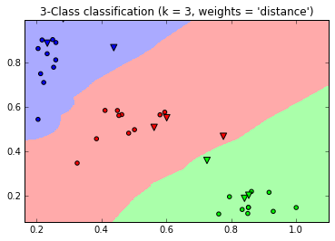

# Letter recognition
Letter recognition using fast fourier transform.

This program performs a fast fourier transform (FFT) on the characters then applies a mask. 

## Requirements 

* Python 
* Numpy
* Scipy
* Skimage
* heapq 

* Jupyter notebook (Optional)
